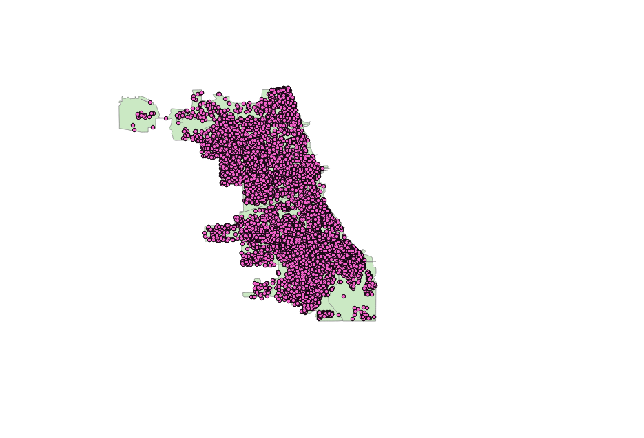

## Research Question / Hypotheses 

Our research aims to show the relationship between the spatial distribution of crimes and the demarcation of police power in the city. We operationalize the concept of "demarcation of police power" by measuring the distance between crime scenes and the location of the police station as well as the distance between crime scene and police beat and district border. The motivation for this research stems from the way a city is divided into districts, invisible to pedestrians, but limiting in the way police can effectively carry out their duty.   

### Research Question 

Our key research question is:
Does the position of a police station and the borders of its respective district have an influence on the way crimes are distributed in a city?

Complementary research questions are: i) Which types of crimes are committed where, in relation to the borders of the district/station? ii) Did certain crimes move away from the police station?

### Hypotheses 

The proposed research questions are connected to the following hypothesis:

**Hyptohesis 1**: The farther away from the police station, the more crimes are committed. 

**Hypothesis 2**: An overall rising number of crimes means crime moves closer to the police station. 

**Hypothesis 3**: For specific crimes, the number of criminal acts near the district borders are higher than those closer to the police station. 
    
    
## Literature Review
See First Part. 
    
## Methodology
The proposed methodology for this assignment is to run a regression using the position of a crime against the different characteristics of the police district and the type of crime as the independent variables. The idea behind this is that depending on the active presence of police in a district, criminals might have incentives to move further away from the places where the police have a more sound presence. In other words, this research is trying to determine if the place where crime hotspots develop has a relation with the position of the police station. The sources of the data, as well as their necessary transformations are described in this chapter. 
    
## Data sources
The main source for accessing data for this research project will be the [Data Portal of the City of Chicago](data.cityofchicago.org). The available information includes all of the crimes that were committed in the city, georeferenced with their exact latitude and longitude, as well as the type and description of the event. Additionally, each entry records if there was an arrest, the respective police jurisdiction, and the location description (specific description of the location of the crime). To obtain this information, the API from the data portal is going to be used. In relation to R, the "import" function, part if the "Rio" package will be used to download the information throught the Portal's API. 

In the same fashion, the information for the police districts is going to be obtained from the City of Chicago Data Portal. However, given the geographical nature of this particular information, it needs to be processed in a different program before it can be included into R. Police Districts are determined by 'shapefiles'. In other words, each district is determined by the x- and y-coordinates of its borders. Additionally, every district contains information of the location of the main police station, as well as support stations within the district. The proposed methodology uses GIS (Geographical Information System) software to determine the distance of every crime committed to the main station, as well as to the closest point in the border of the district. This information is then transfered into R so that it can be processed and used to test the suggested hypothesis. 

Lastly, additional information on crime in cities, as well as further documentation of research on crime, can be found in [this](https://docs.google.com/document/d/1IFHRbKVSlKFpOuTJL1YE2mo5i7qNezlUMi1DHpK27rw/edit) document provided by the [Sunlight Foundation](http://sunlightfoundation.com/policy/municipal_crime/). 
--- Sunlight Foundation document
### QGIS
This is an example of the data available. The points plotted in the map show all of the crimes of type "ASSAULT" committed in the City of Chicago in 2015. From afar, it seems that the crimes committed are randomly located through the whole city.  
- Measuring distances using QGIS. 
-- Challenge: How to integrate the QGIS script into R so that the research can be replicable. 
- Is there visual Evidence for the Hypothesis?
- Mapping movement of crime

### Regression (R)

outline control variables (see https://www.fbi.gov/about-us/cjis/ucr/hate-crime/2011/resources/variables-affecting-crime)

It will be important to control for a number of other factors that affect crime. Especially, economic and demographic factors specific to each city area must be considered. There are, however, a lot of factors that are not readily measurable or for which no data exists. According to @FBI, factors that are known to affect the volume and type of crime occurring from place to place are:

- Population density and degree of urbanization.
- Variations in composition of the population, particularly youth concentration.
- Stability of the population with respect to residents' mobility, commuting patterns, and transient factors. [Location of immigrants]
- Modes of transportation and highway system. [Perhaps Chicago as a city is too small for this?]
- Economic conditions, including median income, poverty level, and job availability. [Travelling distance to and from work]
- Cultural factors and educational, recreational, and religious characteristics.
- Family conditions with respect to divorce and family cohesiveness. [This one might seem hard. Maybe we can catch these unobservables with something else?]
- Climate. [Influence on Crime?]
- Effective strength of law enforcement agencies. [Fixed effects for Police Districts?]
- Administrative and investigative emphases of law enforcement. [Same as above]
- Policies of other components of the criminal justice system (i.e., prosecutorial, judicial, correctional, and probational). [Again, maybe fixed effects might take care of this. If there was a change in between the period of analysis we might be capturing a change in the trend]
- Citizens' attitudes toward crime. [survey on the city?]
- Crime reporting practices of the citizenry.

## Bibliography 
