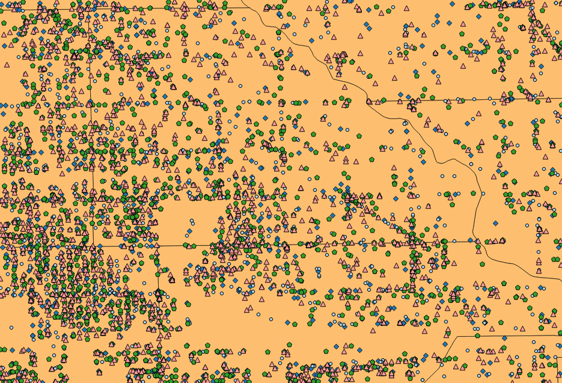

## Summary 

This research project aims to analyze the relationship between the location of reported crimes in a city and the spatial demarcations of police power, i.e. the location and distribution of police stations, beats and police districts accross the city. Using data on the City of Chicago (and eventually other cities), we look into crime as a function of the distance to police stations and the borders of police districts. We analyze whether certain crimes are more likely to be perpetrated at the fringes of districts and whether the average distance of certain crimes to either the police stations or district boundary has significantly changed over the last few years. Our reserach aims to show trends in the spatial distribution of crimes as a function of the intentional or unintentional demarcation of police power in the city. This could represent an important contribution to the general 'Crime Hotspot' location theory. Our findings can inform both police forces and policy-makers in their planning and decision-making. In terms of methodology, we use R to obtain publicly available data on crime from the respective city database(s). To visualize the location data and calculate distances, we rely on the open-source Geographic Information System QGIS. R will be used to create a regression model and visualize our findings. The whole project is available on GitHub: [CrimeMapping](https://github.com/martinezsebastian/CrimeMapping)

## Introduction 

Every community deals with the presence of crime. Criminal activity has a multitude of causes and the origins of crime have been the subject of investigation by many disciplines. The organization of law enforcement's response is a key factor in understanding the nature and extent of crime occurring in a specific area. For example, one city may be better at fighting crime, because it has correctly identified hotspots and distributed its police forces accordingly. This often includes setting up additional police stations in trouble zones or adjusting police district and beat boundaries to better allocate existing forces.

This research project will aim at tracking the relation between the location of reported crimes in a city and the spatial demarcations of police power. We especially focus on the location and distribution of police stations, police beats and districts accross the city. By looking at crime as a function of the distance to police stations and district borders, we analyze whether certain crimes are more likely to be perpetrated at the beat or district borders and whether the average distance of certain crimes to either the police stations or boundary has significantly changed over the last few years. If, for example, crime hotspots were to move towards the police stations, this could signify a drop in police performance over a certain time period. In this regard, this research also touchs upon the question of effectiveness of police work. For example, holding other factors relatively constant, differences in crime levels at the district borders could potentially indicate different levels of  cooperation between police districts in a given city. 

## Research Question / Hypotheses 

Our research aims to show the relationship between the spatial distribution of crimes and the demarcation of police power in the city. We operationalize the concept of "demarcation of police power" by measuring the distance between crime scenes and the physical location of the police station as well as the distance between crime scene and police beat and district border. The motivation for this research stems from the way a city is divided into organizational districts, invisible to pedestrians, but potentially limiting in the way police can effectively carry out their duty.   

### Research Question 

Our key research question is:
Does the position of a police station and the borders of its respective district have an influence on the way crimes are distributed in a city?

Complementary research questions that can be approached are: i) Which types of crimes are committed where, in relation to the borders of the district/station? ii) Did certain crimes move away from/towards the police station?

### Hypotheses 

The proposed research questions are connected to the following hypotheses:

**Hyptohesis 1**: The farther away from the police station, the more crimes are committed. 

**Hypothesis 2**: An overall rising number of crimes means crime moves closer to the police station. 

**Hypothesis 3**: Specific crimes are mostly perpetrated near the district borders; their chance to occur closer to police stations is low. 

## Literature Overview and Relevance of Research

The origins of crime have been the subject of investigation by many disciplines. A significant amount of the literature has looked at socioeconomic conditions to explain the occurence of urban crime. @Blau1982, for example, finds that "socioecconomic inequality between races, as well as economic inequality generally, increases the rates of criminal violence". @Delbecq, in their analysis of Chicago crime, see criminal activity "rooted in a lack or a weakening of social control exerted by communities because of poverty, residential instability and racial/ethnic heterogeneity". However, an increasing amount of literature includes spatial characteristics of neighborhoods and districts, including urban structure, urbanisation levels, land/zone use, the presence of graffiti, garbage and run-down buildings, employment density, pollution, availability of public transport, and other variables in their analysis. @Charron2009

Some literature has looked primarily at the effects of a city's spatial characteristics on crime. Described in a more conceptual manner, a city is not only set of objects placed one next to the other, but a set of places with specific functions designed for its citizens. The inhabitants interact with the physical space and vice versa; thus shaping both available actions as well as surrounding structure. For example, researchers have found that a denser, mixed used neighborhood has a smaller number of crime occurrences than a sprawled, more spread out neighborhood. @Morenoff:1997ux specifically show that crime has a spatial component, often ignored by social researchers. They also argue that depending on the physical structure of a city, areas with high crime can spread out to neighboring areas in a process called "spatial diffusion of crime". Further, @Rosenfeld:1999vv found that when controlling for neighborhood demographic characteristics, the spatial distribution of crime is due to both the intrinsic characteristics of gang culture and the facilitating neighborhood characteristics. @Leenders:2002fa, for example, builds on this research in his calculation of weights matrices to determine the use composition of a block, but also its relation with neighboring blocks, to allow for empirical research on the diffusion effects of crime. 

Other research, especially criminological literature, focuses more on the operative part of crime prevention, but also heavily relies on the research on the effects of spatial characteristics. The "Broken Windows Theory" postulated by James Q. Wilson and George Kelling in 1982 in an influential article in the Atlantic Monthly represents an important starting point. @Wilson suggest that targeting minor disorder, e.g. vandalism, broken windows could help reduce more serious crime. The theory assumes that the landscape "communicates" to people. A broken window transmits to criminals the message that a community displays a lack of informal social control, and is therefore unable or unwilling to defend itself against a criminal invasion. In more recent literature, this theory is, however criticized for its simplicity. Acccording to @Harcourt, evidence from New York City crime data and from social experiments in five US cities would "provide no support for a simple first-order disorder-crime relationship as hypothesized by Wilson and Kelling, nor for the proposition that broken windows policing is the optimal use of scarce law enforcement resources."

While urban hotspots of crime are often well documented, there has been, according to @Zipkin2014, only limited research on "optimal and dynamically adapting police responses to changing crime patterns". By looking at the the City of Chicago's data, we aim to contribute to the research that tries to understand optimal police responses both on the operative as well as on the organizational level. 

## Methodology
The proposed methodology is to run a regression using the *relative* position of a crime against the specific characteristics of the police district and the type of crime as independent variables. The idea behind this is that depending on the active presence of police in a district, criminals might have incentives to move further away from the places where the police have a more sound presence. In other words, this research is trying to explain the development of crime hotspots in relation to the organizational distribution of responsibility to specific police forces in a city. The data sources, as well as the necessary transformations are described in this chapter. 

### Data Collection 
The main source for accessing data for this research project will be the [Data Portal of the City of Chicago](data.cityofchicago.org). The available information includes all crimes that were reported in the city, georeferenced with their exact latitude and longitude, as well as the type and description of the event. Additionally, each entry records if there was an arrest, the respective police jurisdiction, and the location description (specific description of the location of the crime). To obtain this information, we use the data portal's API and R's "import" function, which is part of the "Rio" package.

In the same fashion, the information for the police districts is going to be obtained from the City of Chicago Data Portal. However, given the geographical nature of this particular information, it needs to be processed in a different program before it can be included into R. Police Districts are determined by 'shapefiles'. In other words, each district is determined by the x- and y-coordinates of its borders. Additionally, every district contains information of the location of the main police station, as well as support stations within the district. The proposed methodology uses GIS (Geographical Information System) software to determine the distance of every crime committed to the main station, as well as to the closest point in the border of the district. This information is then transfered into R so that it can be processed and used to test the suggested hypothesis. 

Lastly, additional information on crime in cities, as well as further documentation of research on crime, can be found in [this](https://docs.google.com/document/d/1IFHRbKVSlKFpOuTJL1YE2mo5i7qNezlUMi1DHpK27rw/edit) document provided by the [Sunlight Foundation](http://sunlightfoundation.com/policy/municipal_crime/). Depending on the success of out first approach in Chicago, we plan to extend the research to other cities that provide the relevant data, as mentioned in this document. 

The reported crime information is currently being processed. There are some missing values that need to be revised, and not all of the crime types are going to be (initially) considered. The information on police districts, police stations and beats have already been procured. 

### QGIS
To visualize the location data and calculate distances, we rely on the open-source Geographic Information System QGIS. The following is an example from the available data. The points plotted in the figures 1 and 2 show all crimes of type "ASSAULT" committed in the City of Chicago in 2015. In Figure 1, it seems that the crimes committed are randomly located through the whole city, except for maybe the very north and south.  

**Figure 1**

Closer inspection in Figure 2,  however, shows that crimes are not randomly located over the grid of Chicago's streets, or the police districts, but rather follow certain patterns.  

**Figure 2**
.  
  
These patterns will certainly be shaped by the physical structure of the city, but might also be influenced by other factors. For example, this could be the proximity of a police station - as we assume in hypothesis 1 - or a police district border. Figure 3 shows the position of the reported crimes for different years. The fact that they are not always in the same place suggest that there is evidence to pursue hypothesis 2 and hypothesis 3. 

**Figure 3**  

_Triangles: 2012; Pentagons: 2013; Circles: 2014; Rhombus: 2015_

### Regression (R)

Finally, we will rely on a regression to explain the occurence of crime at specific locations as a function of the spatial allocation of police force in a city. Our dependent variable is the occurence of specific crimes. Independent variables are the distance to the main and support police stations as well as the distance to beat and police district borders. The City of Chicago also offers information on police funding over the years on a district level. It is, however, not easily discernible whether year-to-year budget changes are actually funding active police work or are, for example, neccessary to cover pensions.

For the regression, we have to control for the specific characteristics of the police districts in question that affect crime. Economic and demographic factors in each city area must be considered. The Data Portal of the City of Chicago includes Census data that is aggregated on the community level which allows us to control for a number of socioeconomic effects on crime. There are, however, some factors that are not readily measurable or for which no data exists. In order to account properly for the spatial characteristics of certain districts, we may also include data on the characteristics of streets. In general, factors that are known to affect the volume and type of crime occurring from place to place are, according to @FBI:

- Population density and degree of urbanization.
- Variations in composition of the population, particularly youth concentration.
- Stability of the population with respect to residents' mobility, commuting patterns, and transient factors.
- Modes of transportation and highway system.
- Economic conditions, including median income, poverty level, and job availability.
- Cultural factors and educational, recreational, and religious characteristics.
- Family conditions with respect to divorce and family cohesiveness.
- Climate.
- Effective strength of law enforcement agencies.
- Administrative and investigative emphases of law enforcement.
- Policies of other components of the criminal justice system (i.e., prosecutorial, judicial, correctional, and probational).
- Citizens' attitudes toward crime.
- Crime reporting practices of the citizenry.

## Bibliography 

